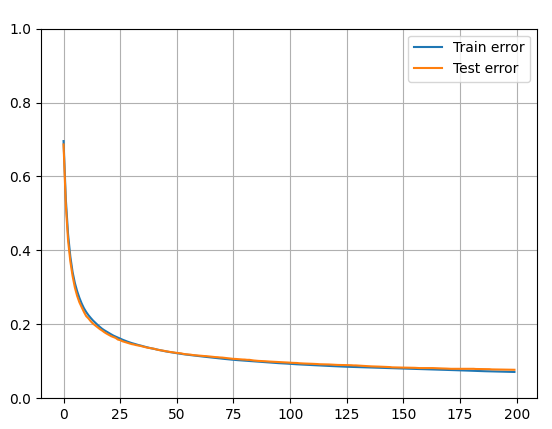

# MLP

MLPClassifier stands for Multi-layer Perceptron classifier which in the name itself connects to a Neural Network. Unlike other classification algorithms such as Support Vectors or Naive Bayes Classifier, MLPClassifier relies on an underlying Neural Network to perform the task of classification.

# Obtained results:

After 200 training session with a 0.0001 learning rate, 100 size batch. We obtained an accuracy of around 0.92

